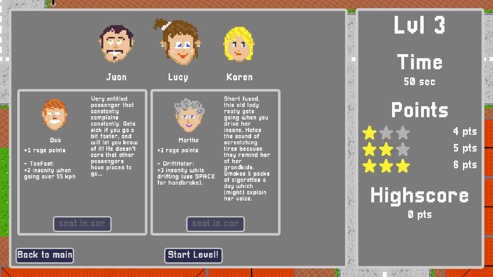
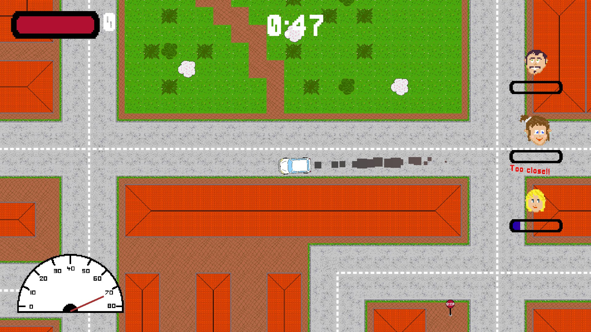
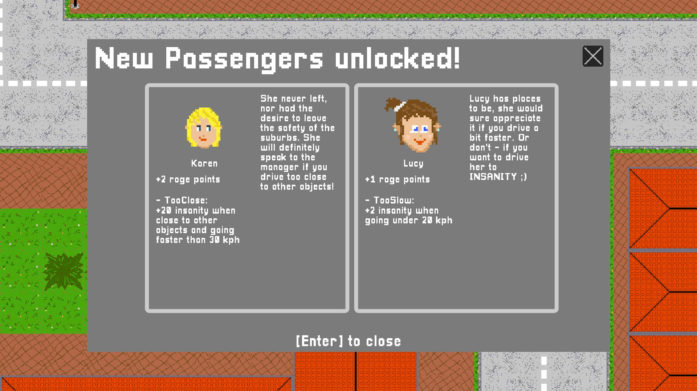

# Drive me Insane!
A top-down racing game where your goal is to drive your passengers to insanity by driving like an absolute maniac!
Choose your passengers from a roster of 9 crazy characters & leverage their unique effects (such as farting - gain passive insanity for all other riders) to achieve maximum synergy.
If you fill enough insanity-bars, you can complete all 5 levels.

This game was made for the github [gameoff jam in December 2022](https://itch.io/jam/game-off-2022/rate/1812204) with the help of some friends for graphics and sound design.
The game engine is godot (3.0).

You can play the game on itch using [this link](https://pastra98.itch.io/drive-me-insane).
The game is feature complete and in a playable state, however the sound mixing still needs some work.

## Screenshots
Choose your passengers:  

Drive & Drift around the map:  

Unlock new passengers:  
